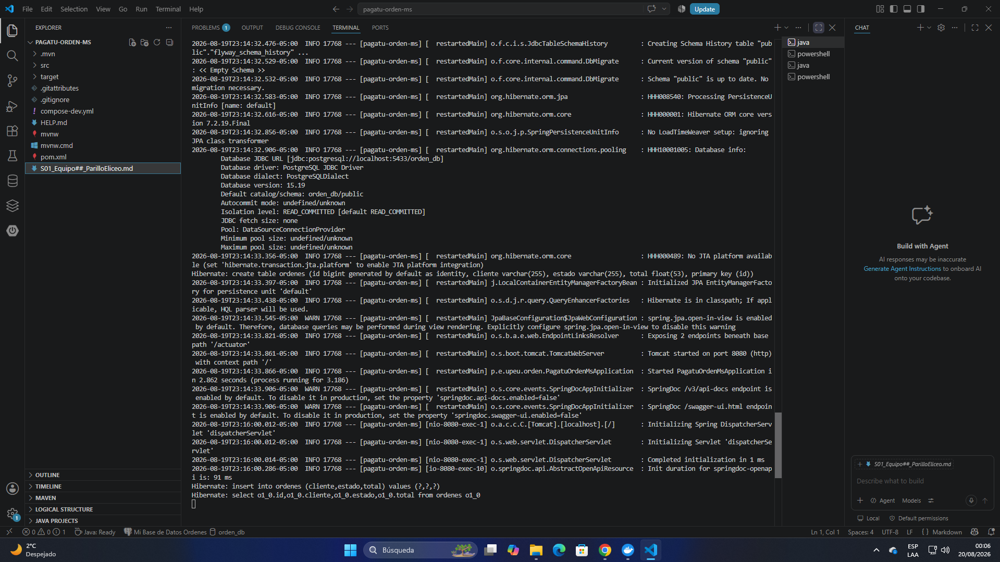
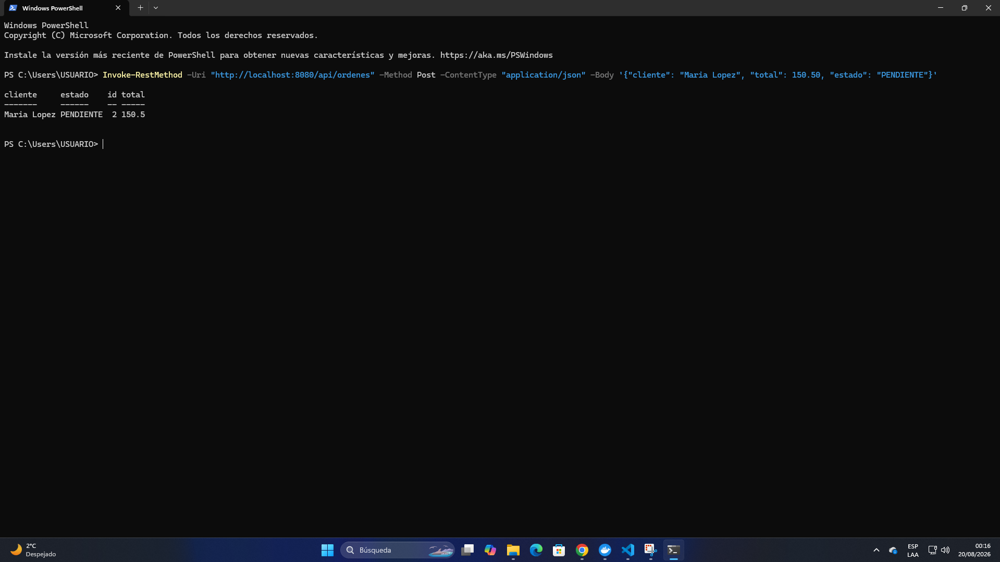
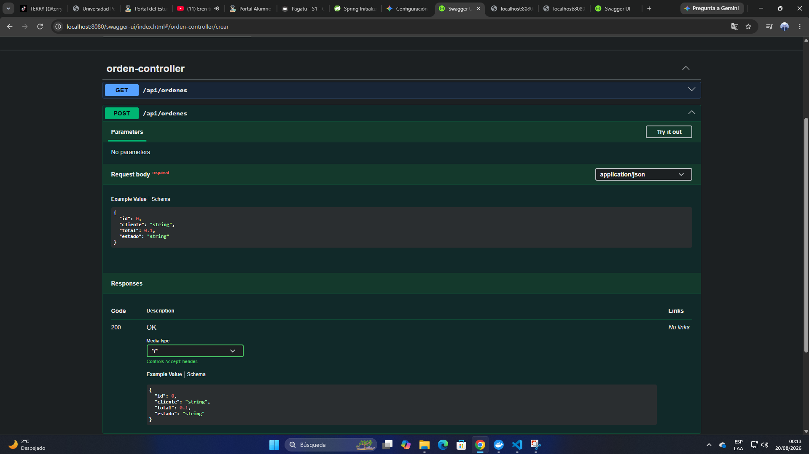
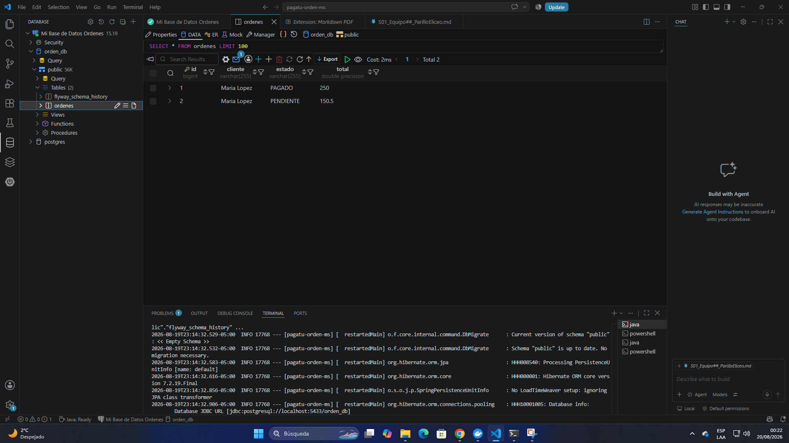
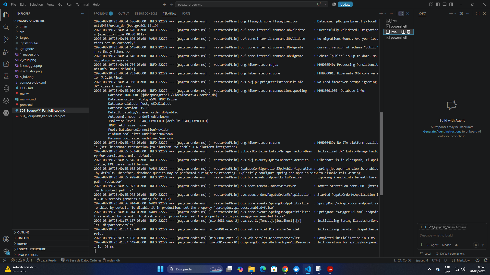
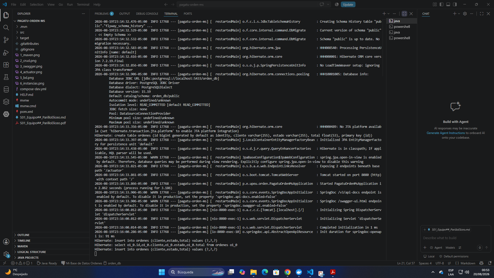

# Actividad Autónoma: Replicación de Microservicio (orden-ms)

**Estudiante:** Eliceo Parillo Mostajo  
**Equipo:** ##

---

### 1. Ejecutar el microservicio en DEV con Maven Wrapper

### 2. Probar el CRUD por PowerShell

### 3. Verificar Swagger, /actuator/health y /actuator/metrics
  

### 4. Revisar la base de datos

### 5. Ejecutar dos instancias en paralelo (8080 y 8081)
  

### 6. ¿Por qué un microservicio debe poder escalar horizontalmente sin puerto fijo?
El escalado horizontal dinámico es un pilar fundamental en la arquitectura de microservicios por las siguientes razones técnicas:

* **Prevención de conflictos de puertos:** En entornos de producción (contenedores Docker/Kubernetes), múltiples instancias residen en el mismo host. Asignar un puerto estático causaría conflictos de vinculación, impidiendo el despliegue automático.
* **Abstracción mediante API Gateway:** La escalabilidad requiere que el cliente ignore la dirección IP o puerto específico de una instancia. El uso de puertos dinámicos obliga a integrar un **API Gateway** o balanceador de carga, que actúa como punto de entrada único, enrutando el tráfico hacia las instancias saludables.
* **Elasticidad y Agilidad:** Desplegar instancias en puertos arbitrarios permite que el orquestador gestione el ciclo de vida del servicio (creación, destrucción, recuperación ante fallos) de forma transparente, optimizando la disponibilidad y la eficiencia de los recursos.